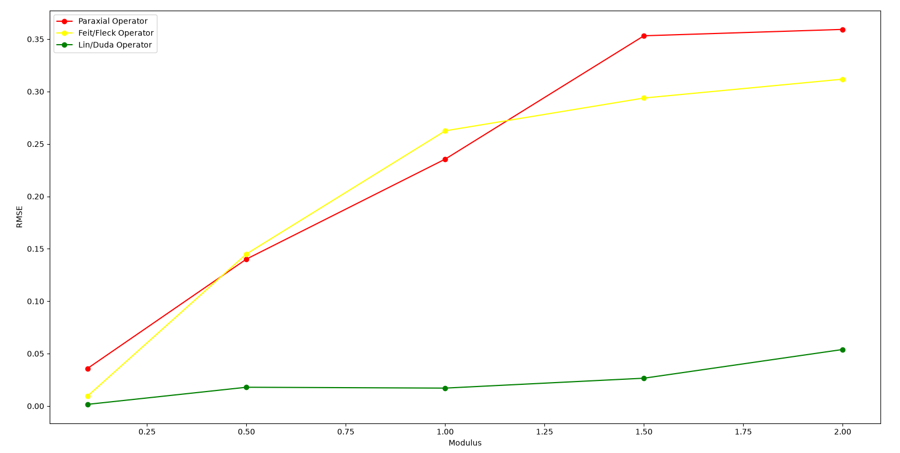
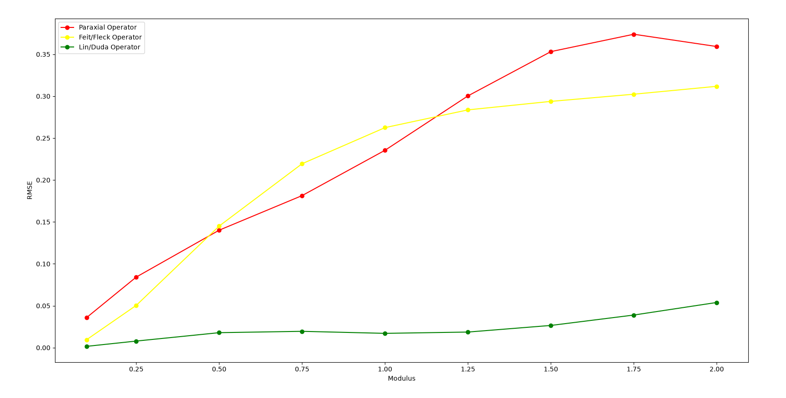
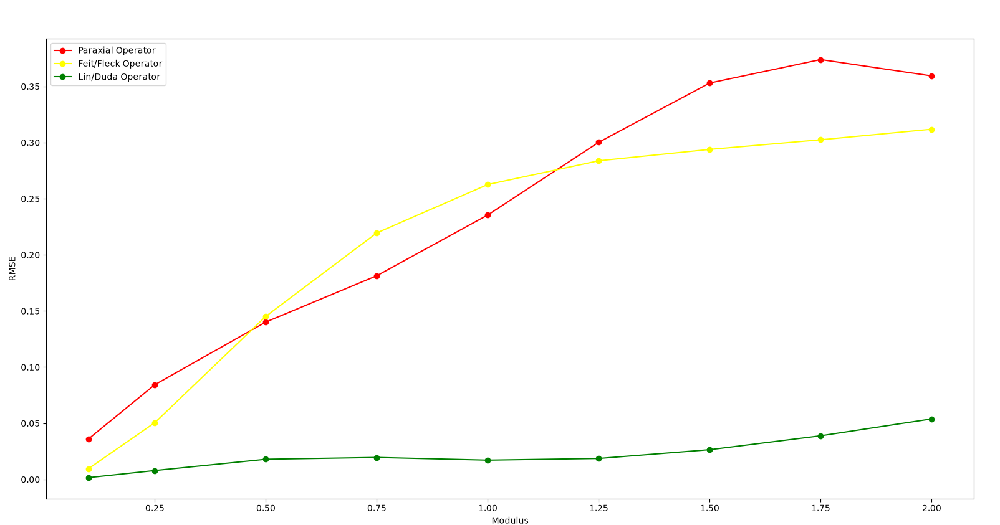
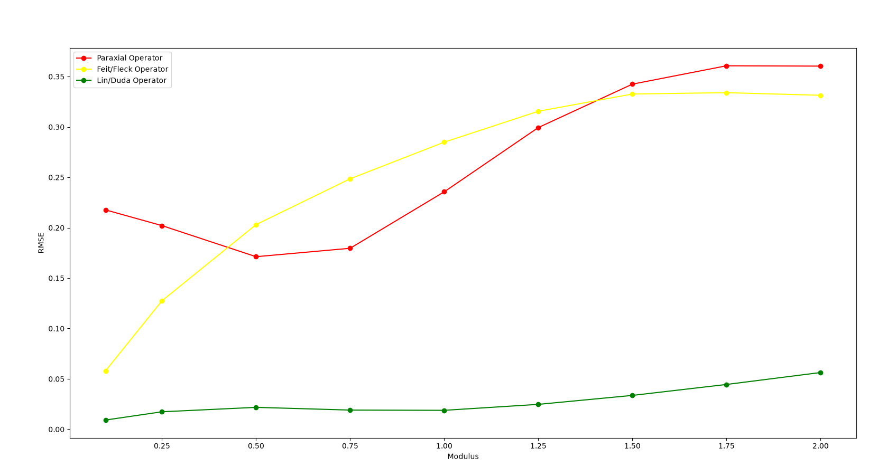

# How different operators do as sample strength increases

These tests use the frozen Apoferritin sample. The first test uses a divergence angle of 0.1°.

As the modulus (the sample strength) increases, all operators experience more error (measured using RMSE, root mean square error). Paraxial and Feit/Fleck had similar errors up to 1.00 when Feit/Fleck became more accurate than paraxial. Lin/Duda was the most accurate, having significantly less error than the other two. Strangely, Paraxial was slightly more accurate than Feit/Fleck between around moduli 0.5 to 1.1, prompting the same test to be done but with more in-between values.

At a higher resolution it is more obvious that Paraxial performs slightly better within that band.

The same test with a divergence angle of 0° is very similar to with 0.1°.

The same test with a divergence angle of 40° stil has Lin/Duda performing significantly better than Paraxial and Feit/Fleck. However, Paraxial's error starts much higher and it becomes more accurate as modulus increases until 0.50, when Paraxial starts become worse. The band in which Paraxial is more accurate than Feit/Fleck is larger than in 0°, lasting roughly from moduli 0.4-1.4. The error of Feit/Fleck is higher for the same modulus compared to lower divergence angles.

For all results, Lin/Duda has about 0 error at 0 modulus, then increasing at a peak around 0.5-0.75, then decreasing until about 1, then increasing again. Lin/Duda never reaches an RMSE value above 0.1.
