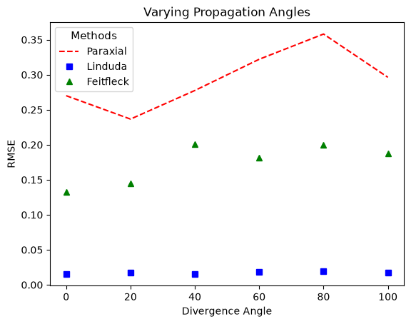

1) With a controlled divergence angle set to 0.0 changes in the 2D wave field plots become visible as the modulus is increased. With a low modulus of 0.1, the object has a weaker scattering ability, with the model reflecting a more centralized pattern. As the propagation distance z reaches around 50 the transverse coordinate x remains around -10 to 10. While if the modulus increases to 0.4 the 2D field propagation phase starts to take on a less inverted shape & the amplitude model starts to fan out and scatter more as distance increases. This trend is continued as the modulus is raised to 0.8 demonstrating how as the modulus increases it causes the sample to have a more intense interaction with the wave, leading to larger amplitude and phase changes. 

2)  With a controlled sample modulus set to 0.0, as the divergence angle of the beam increases the 2d plots reflect the changes through the speed at which the beam spreads as it propagates. with a lower divergence angle of 1 the 2D models demonstrate a steady pattern with little to no change as the distance increases. If this is increased to 10 a more triangular visual begins to form in each model and the intensity of the beam decreases faster. The beam becomes more diffracted and fanned out when the divergence angle is raised to 20, demonstrating how a larger angle relates to a more rapidly expanding wavefront. The RMSE is also affected as as the divergence angle is increased. When the divergence is lower each operator produces a similar RMSE. Such as at a diffraction angle of 1 the feit/fleck operator is around 1.871442e-13,lin/duda at 1.67112e-13, and paraxial at 2.989132e-5. As the angle is raised, Q2 and Q3 operators go through a smaller amount of change and become more similar, such as at divergence of 20 both RMSE's were at 2.306393e-13. while the Q1 went up to around 1.205676e-01. 
 
3) The Bending Tunnels sample demonstrates how as the divergence angle of the beam increases the wavefront fanes out more rapidly. When the divergence angle is set to 0, the 2d model representing the phase has an inverted triangular pattern, while the amplitude has a steady beam condensed in a strait line with no visible diffractions. As the divergence angle grows, phase  steadily increases, fanning as distance rises, while amplitude has a decreasing intensity as distance increases and clearer wavelengths. In addition to the plots representing the data the RMSE of the operators also reveals the changes. Feit/Fleck (Q2) and Lin/Duda(Q3) were most similar, steady becoming identical, each with 2.306393e-13 at divergence angle of 20. While Paraxial operator grew slightly faster then Q2 and Q3, going from 1.765748e-05 to 1.205676e-01. Overall sample Apoferritin and bending tunnels show different exact data but illustrate similar trends to each other. 

4) Using the sample Strait waves guide and a controlled divergence angle of 20 with a modulus of 0.8 testing changes of period and corewidth. When period and corewidth were both at their average set amounts (10 and 1.5) one strait intense line went down the center of the model while having fanning behind it in darker colors. when period increased the intense line got darker in some areas while the background fanning stared to get more similar to the band until it reached 30. as period was raised the RMSE stayed stagnant. When the corewidth was raised the bright band going down the center of the model got wider and more fanned out in its middle but thinned out on either edge. In addition as the corewidth was heightened the phase model would experience more rapid transitions from brighter to darker. Unlike when period was raised with the corewidth the RMSE had larger changes. With lin/duda the number grew from 5.389573e-03 to 1.174526e-02, while feit/fleck slowly raised from 4.2971885e-02 to 9.029259e-02, and paraxial decreased from 1.1093023e-01 to 9.766874e-02 

5)  Varying propagation. 
The operators errors vary as the divergence angle is adjusted.
 
 As the divergence angle is raised the 3 operators output different RMSE levels. Paraxial experiences the most change as the angle adjusts, in comparison to the other operators it rapidly falls, raises, then begins to lower again. Throughout the paraxial demonstrates a higher error rate. Feitfleck shows a slowly raising trend in its RMSE as the angle increases, while the Linduda stays comparable constant. Linduda yields the lowest RMSE throughout while Feitfleck remains between Q1 and Q3.