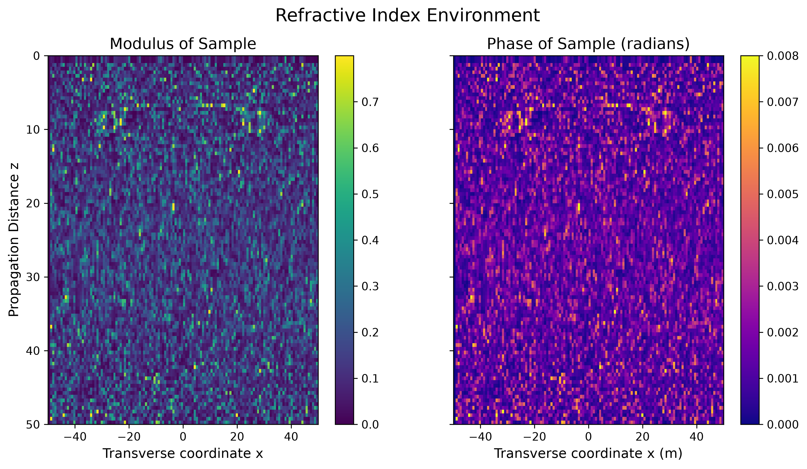
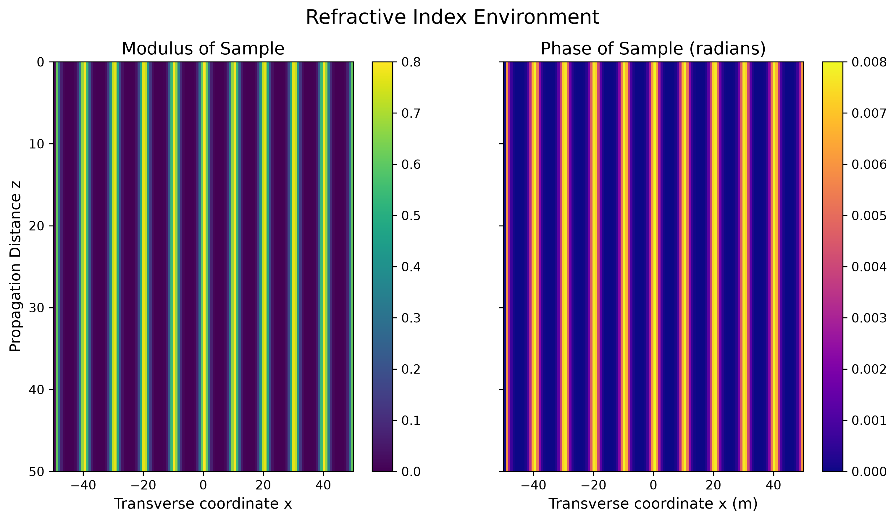
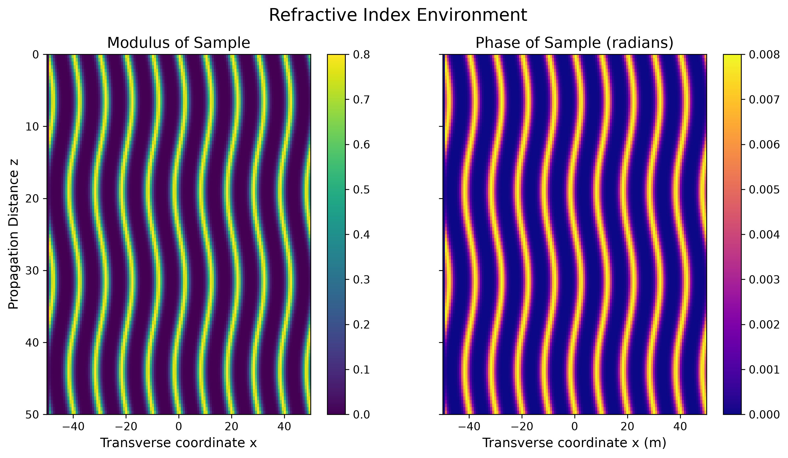
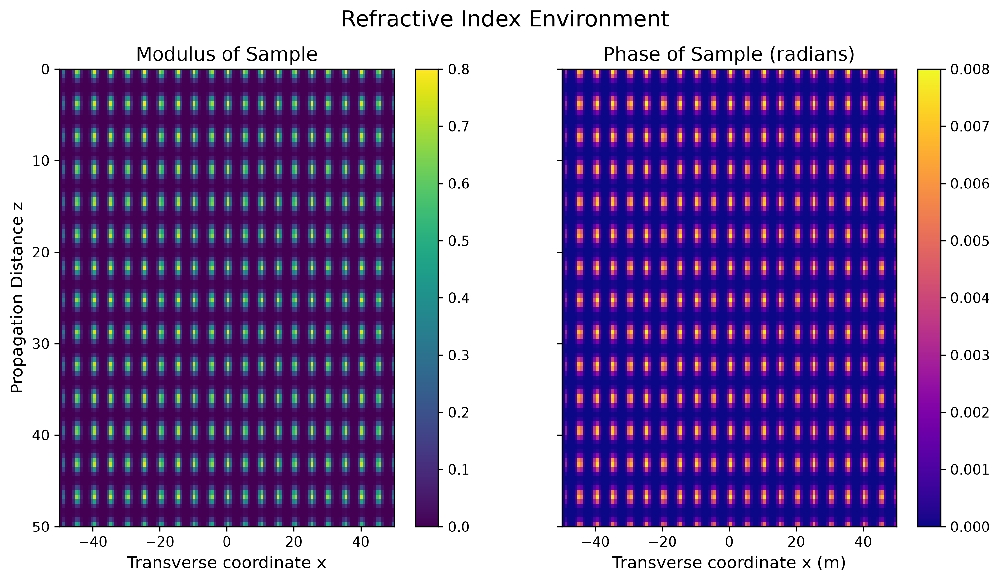
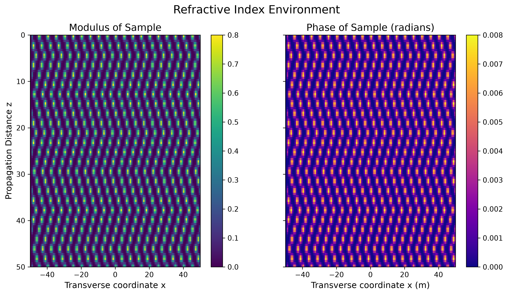

# Samples Guide

In this simulation, you are exploring how light travels through different
objects. Think of these "Samples" as the items you are placing under the
microscope. Each one creates a different pattern of light when you run the
simulation.

A sample is a *geometry*, not a run: it knows what the permittivity is at every
`(x, z)`, and nothing about the operators. Every sample is a dataclass with
keyword parameters, all of which have defaults, so `StraightWaveguides()` is a
valid sample.

Two parameters recur throughout, so they are worth explaining once:

* **`modulus`** — the strength of the scattering potential. It sets the size of
  `eps`, which is the whole difficulty of the problem: at small `modulus` every
  operator agrees, and the differences between them only appear as the sample
  scatters harder.
* **`phase`** — a phase perturbation applied on top, in radians. `0.0` gives a
  purely real permittivity, which keeps the propagation unitary.

---

## 1. Apoferritin

A simulation of an experimental biological sample derived from a 2D
cross-section array. This is ideal for testing realistic, complex diffraction
patterns. Apoferritin is a protein that stores iron in cells, and its structure
is well-studied in structural biology.

The data ships with the package and is resampled to whatever `(Nz, N)` your
grid uses, then cached per grid size, so repeated runs pay for the interpolation
once.



| Parameter | Type | Default | Description |
| --- | --- | --- | --- |
| `modulus` | `float \| None` | `None` | Rescales the loaded structure to `[0, modulus]`. Leave it as `None` to use the stored values unchanged. |
| `file_path` | `Path` | the bundled `.npy` | Where to load the structure from. Override to supply your own `(Nz, Nx)` array. |

**Usage:**

```python
from ptychobench.samples import Apoferritin

sample = Apoferritin(modulus=0.08)
```

---

## 2. StraightWaveguides (The Light Tunnels)

A periodic array of straight Gaussian waveguides, useful for studying how light
traps within defined channels without variation along the propagation axis.



| Parameter | Type | Default | Description |
| --- | --- | --- | --- |
| `modulus` | `float` | `0.01` | The strength of the waveguides. |
| `phase` | `float` | `0.0` | Phase perturbation, in radians. |
| `num_cores` | `float` | `5.0` | How many waveguide cores span the domain. |
| `core_width` | `float` | `1.5` | The Gaussian width of each core. |

**Usage:**

```python
from ptychobench.samples import StraightWaveguides

sample = StraightWaveguides(modulus=0.08, num_cores=7)
```

---

## 3. SharpStraightWaveguides (The Hard-Edged Tunnels)

The same layout as `StraightWaveguides`, but with hard, top-hat edges instead
of Gaussian ones — and an optional blur to soften them by a controlled amount.

That knob is the point of this sample. A sharp edge has a broad spectrum, so it
is the case that stresses a wide-angle operator hardest; turning `blur` up
walks continuously back towards a smooth sample, which is a good way to see
where an approximation starts to fail.

| Parameter | Type | Default | Description |
| --- | --- | --- | --- |
| `modulus` | `float` | `0.01` | The strength of the waveguides. |
| `phase` | `float` | `0.0` | Phase perturbation, in radians. |
| `num_cores` | `float` | `5.0` | How many waveguide cores span the domain. |
| `core_width` | `float` | `1.5` | The full width of each core. |
| `blur` | `float` | `0.0` | Gaussian blur applied to the edges, in pixels. `0.0` leaves them perfectly sharp. |

**Usage:**

```python
from ptychobench.samples import SharpStraightWaveguides

sample = SharpStraightWaveguides(modulus=0.08, blur=2.0)
```

---

## 4. ZigWaveguides (The Bending Tunnels)

Like `StraightWaveguides`, but the cores wiggle sinusoidally along the
propagation axis, completing two full periods over `z_prop`.



| Parameter | Type | Default | Description |
| --- | --- | --- | --- |
| `modulus` | `float` | `0.08` | The strength of the waveguides. |
| `phase` | `float` | `0.0` | Phase perturbation, in radians. |
| `num_cores` | `float` | `5.0` | How many waveguide cores span the domain. |
| `core_width` | `float` | `1.5` | The Gaussian width of each core. |
| `wiggle_amp` | `float` | `2.0` | The transverse amplitude of the curvature. |

**Usage:**

```python
from ptychobench.samples import ZigWaveguides

sample = ZigWaveguides(modulus=0.08, wiggle_amp=3.0)
```

---

## 5. StraightBalls (The Dot Grid)

A sequence of discrete, localized spherical features arranged in straight
vertical lines. Use this to study scattering from round objects lined up in a
row.



| Parameter | Type | Default | Description |
| --- | --- | --- | --- |
| `modulus` | `float` | `0.08` | Scattering strength. |
| `phase` | `float` | `0.0` | Phase perturbation, in radians. |
| `num_balls` | `int` | `15` | Number of spherical features along the z-axis. |
| `ball_radius` | `float` | `0.8` | The radius of each feature. |
| `x_period` | `float` | `5.0` | Transverse spacing between columns. |

**Usage:**

```python
from ptychobench.samples import StraightBalls

sample = StraightBalls(modulus=0.08, num_balls=20)
```

---

## 6. ZigBalls

Spherical features arranged in a sharp, piecewise zig-zag pattern.



| Parameter | Type | Default | Description |
| --- | --- | --- | --- |
| `modulus` | `float` | `0.08` | Scattering strength. |
| `phase` | `float` | `0.0` | Phase perturbation, in radians. |
| `num_balls` | `int` | `25` | Total number of spheres. |
| `ball_radius` | `float` | `0.8` | The radius of each feature. |
| `x_period` | `float` | `5.0` | Transverse spacing between columns. |
| `x_amplitude` | `float` | `3.0` | How far the balls shift transversely across the zig-zag. |

**Usage:**

```python
from ptychobench.samples import ZigBalls

sample = ZigBalls(modulus=0.08, x_amplitude=4.0)
```

---

## Working With a Sample

Every sample offers the same handful of methods, whichever one you picked.

```python
from ptychobench.grid import SimulationGrid
from ptychobench.samples import ZigBalls

grid = SimulationGrid(N=512, L=40.0, z_prop=20.0)
sample = ZigBalls(modulus=0.08)

# The complex permittivity at one z-slice: a length-N array, in the grid's
# backend, forced to free space (0) outside the domain.
eps = sample.get_permittivity(grid, z=5.0)

# The steepest permittivity gradient anywhere in the sample. A useful sanity
# check: a sample far sharper than your pixel size is under-resolved, and
# every operator will be measuring the grid rather than the physics.
print(sample.max_gradient(grid))
```

### Looking at it

```python
# The full (x, z) map, modulus and phase
sample.plot(grid)

# One transverse slice, in real space or in the Fourier domain
sample.plot_cross_section_modulus(grid, z=0.0)
sample.plot_cross_section_modulus(grid, z=0.0, fourier=True)
sample.plot_cross_section_phase(grid, z=0.0)
```

These display the figure and also return it, so you can save or adjust it. If
you want the figure *without* it being shown — inside a report, say — call the
underlying functions in `ptychobench.plotting` instead:

```python
from ptychobench import plotting

fig = plotting.plot_sample_profile(sample, grid)
fig.savefig("my_sample.png")
```

---

## Writing Your Own Sample

Subclass `Sample` and implement one method, `_profile`. It returns the raw
permittivity for a z-slice; the base class applies the free-space boundary for
you, and converts to the grid's backend, so you do not have to do either — and
returning plain NumPy is fine.

```python
from dataclasses import dataclass
import numpy as np
from ptychobench.samples import Sample


@dataclass
class SingleSlab(Sample):
    """A single rectangular slab of material, centred on the axis."""

    modulus: float = 0.05
    width: float = 4.0

    def _profile(self, grid, z: float):
        xp = grid.xp
        inside = abs(grid.x) <= self.width / 2
        return self.modulus * xp.where(inside, xp.ones_like(grid.x), xp.zeros_like(grid.x))
```

That sample now works everywhere the shipped ones do — including on a torch or
CUDA grid, because it built its geometry from `grid.x` in `grid.xp` rather than
reaching for NumPy directly. If a piece of the geometry genuinely needs the
host (SciPy has no Array API equivalent for most of `scipy.ndimage`, which is
exactly why `SharpStraightWaveguides` does its blur on the host), convert with
`ptychobench.utils.to_numpy`, do the work, and return the result — the base
class carries it back to the grid's device.
