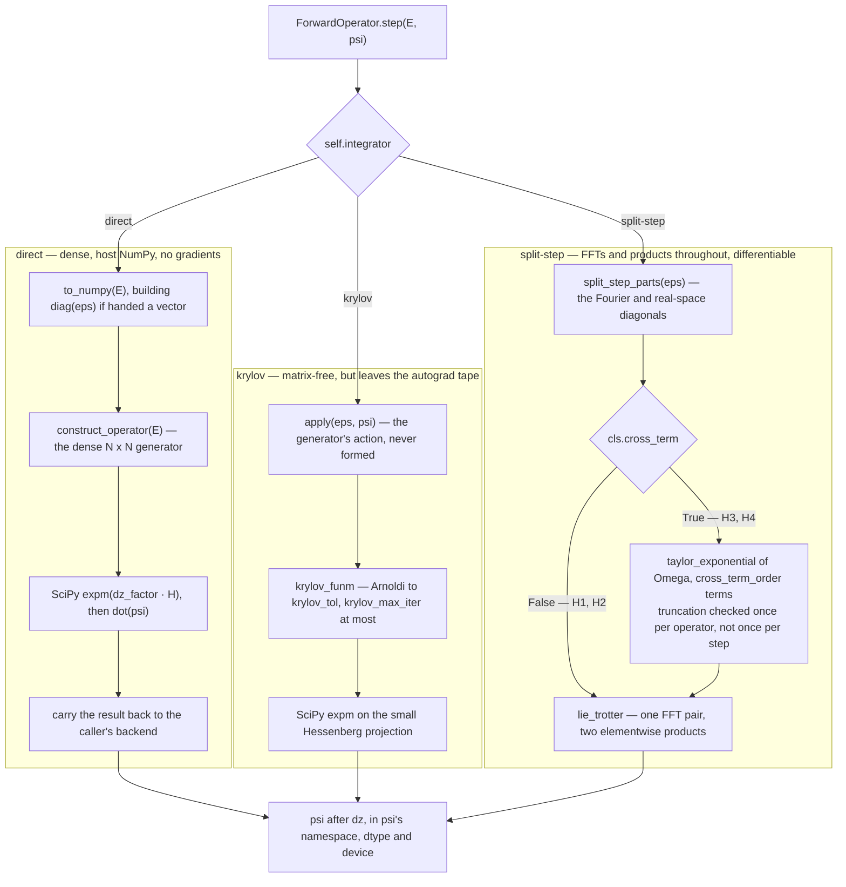

# Wave Propagation Framework: Mathematical Background

For the plain-language version of the physics, see
[Physics Simulation](physics_simulation.md). This page is the derivation, the
operator algebra and the numerics.

## 1. Governing Equations: Helmholtz Equation to Forward Propagation Equation

The stationary state of monochromatic light propagation through a medium with refractive index $n$ is governed by the Helmholtz equation:

$$\nabla^2 u + k_0^2 n^2 u = 0$$

Solving this exactly in 3D is computationally expensive. To simplify, we define the transverse operator $\mathcal{Q}$ as:

$$\mathcal{Q} = \sqrt{1 + \mu + \epsilon}$$

where $\epsilon = n^2 - 1$ is the refractive index perturbation and $\mu = k_0^{-2}\nabla_{\perp}^2$ is the kinetic operator.

Using this, we can factor the Helmholtz equation:

$$\left(\frac{\partial}{\partial z} + i k_0 \mathcal{Q}\right)\left(\frac{\partial}{\partial z} - i k_0 \mathcal{Q}\right) u  - i k_0 \left[\mathcal{Q},\frac{\partial}{\partial z}\right]u = 0$$

Assuming that backscattering and the commutator term are negligible, we can reduce the Helmholtz equation to a first-order differential equation in $z$:

$$\frac{\partial u}{\partial z} = i k_0 \mathcal{Q} u$$

This is the forward Helmholtz propagation equation. To remove the fast-oscillating phase term of the carrier wave, we consider the envelope equation $u = \exp(i k_0 z) \psi$.

$$\frac{\partial \psi}{\partial z} = i k_0 (\mathcal{Q}-1) \psi$$

## 2. The Exponential Propagation Operator

Writing $\mathcal{H} = \mathcal{Q} - 1$ for the transverse generator, the envelope equation is

$$\frac{\partial \psi}{\partial z} = i k_0 \mathcal{H} \psi,$$

and the exact solution over a step $dz$ is

$$\psi(z + dz) = \exp(i k_0 \mathcal{H} dz) \psi(z).$$

## 3. Propagation Approximations

In 3D, computing $\mathcal{H}$ is computationally unfeasible. Restricting the
simulation to 2D lets us evaluate it directly and benchmark the standard
approximations against it. Its Taylor series is

$$\mathcal{H}  = \frac{1}{2}(\epsilon + \mu) - \frac{1}{8}(\epsilon^2 + \epsilon\mu + \mu\epsilon + \mu^2) + \dots$$

and each implemented approximation is a different truncation or correction of it:

* **$\mathcal{H}_1$ (Paraxial)** — assumes small scattering angles. *First order.*
    $$\mathcal{H}_1 = \frac{1}{2}(\epsilon + \mu)$$
* **$\mathcal{H}_2$ (Feit/Fleck)** — keeps each of $\epsilon$ and $\mu$ exactly but drops every cross term between them, so it recovers $-\frac{1}{8}(\epsilon^2 + \mu^2)$ and nothing else at second order. Exact when either the potential or the kinetic operator vanishes. *First order.*
    $$\mathcal{H}_2 = \mathcal{L} + \mathcal{N}, \qquad \mathcal{L} = \sqrt{1 + \mu} - 1, \quad \mathcal{N} = \sqrt{1 + \epsilon} - 1$$
* **$\mathcal{H}_3$ (Yevick/Thomson)** — Feit/Fleck with the missing second-order cross terms put back. *Second order.*
    $$\mathcal{H}_3  = \mathcal{H}_2 - \frac{1}{8}(\epsilon\mu + \mu\epsilon)$$
* **$\mathcal{H}_4$ (Lin/Duda)** — the same correction built from the resummed factors, which is better behaved at wide angles because $\mathcal{L}$ stays bounded where $\mu$ does not. *Second order.*
    $$\mathcal{H}_4 = \mathcal{H}_2  - \frac{1}{2}(\mathcal{LN} + \mathcal{NL})$$

Future work will use operator learning to improve on Feit/Fleck, which is the
one most widely used in practice.

---

## 4. Numerical Methods

There are two ways to evaluate $\exp(i k_0 \mathcal{H} dz)\psi$ here: a **dense** path and a **matrix-free** path.

### 4.1 The dense path — the accuracy reference

The dense path forms the full $N \times N$ operator and hands it to SciPy: `expm` (scaling-and-squaring Padé) for the exponential, `sqrtm` (Schur decomposition) for the square root. It costs $\mathcal{O}(N^2)$ storage and $\mathcal{O}(N^3)$ work per step, and it is why the geometry is restricted to one transverse coordinate — see [Physics Simulation §3](physics_simulation.md).

### 4.2 The matrix-free path

The matrix-free path never forms the operator. It needs only the *action* $x \mapsto \mathcal{H}x$, which each approximation supplies in $\mathcal{O}(N \log N)$: the kinetic part is diagonal in Fourier space and the potential part is diagonal in real space, so applying either is an elementwise multiply plus an FFT pair.

#### 4.2.1 Krylov subspace projection (Arnoldi) — `ptychobench.numerics.integrators`

Given the action of $A$ and a vector $v$, the Arnoldi process builds an orthonormal basis $V_m$ of $\mathrm{span}\{v, Av, \dots, A^{m-1}v\}$ together with the small upper Hessenberg $H_m = V_m^H A V_m$, and approximates

$$f(A)v \approx \|v\| \, V_m \, f(H_m) \, e_1$$

with $m$ typically a few tens regardless of $N$. The matrix function is still evaluated densely — by the same `expm`/`sqrtm` — but on the $m \times m$ projection rather than the full operator, which is what makes the dense path a *component* of the matrix-free path rather than a rival to it.

#### 4.2.2 Operator splitting — `ptychobench.numerics.splitting`

Where the operator separates as $\mathcal{H} = \mathcal{L} + \mathcal{N}$ — exactly the Feit/Fleck form of §3 — each factor can be exponentiated elementwise on its own diagonal and no matrix function is needed at all. Because $\mathcal{L}$ and $\mathcal{N}$ do not commute the product $e^{h\mathcal{L}} e^{h\mathcal{N}}$ is an approximation, with local error $\tfrac{1}{2}h^2[\mathcal{L},\mathcal{N}]$ and global order 1 in $dz$.

**A third factor for the operators with a cross term.** $\mathcal{H}_3$ and $\mathcal{H}_4$ add a term that is a *product* across the two bases, so it is diagonal in neither and a two-factor product cannot represent it. They are still reachable by splitting, with a factor for the remainder [Lin & Duda 2012]:

$$\psi(z+\Delta z) = e^{h\mathcal{L}}\, e^{h\mathcal{N}}\, e^{\Omega}\, \psi(z), \qquad \Omega = h\,\mathcal{C},$$

with $\mathcal{C} = -(\mathcal{L}\mathcal{N}+\mathcal{N}\mathcal{L})/2$ for $\mathcal{H}_4$ and $-(\epsilon\mu+\mu\epsilon)/8$ for $\mathcal{H}_3$. $\Omega$ has no diagonal to exponentiate elementwise, so `taylor_exponential` evaluates $e^{\Omega}\psi$ from the action alone as a truncated series, by the recurrence $u_0 = \psi$, $u_m = \Omega u_{m-1}/m$. `cross_term_order` sets how many terms are kept; the default is 4.

The product is still first order overall — three $\mathcal{O}(h)$ factors instead of two — so the commutator error still dominates. What the third factor adds is a second error with a horizon: **truncation costs unitarity.** $\Omega$ is anti-Hermitian, so the exact $e^\Omega$ is unitary and no truncation of it is, and the relative error per step of $r^{M+1}/(M+1)!$ for $r = \lVert\Omega\rVert$ accumulates as a norm drift rather than cancelling. On this package's own grids $r \approx 3\times10^{-5}$, putting the four-term truncation at $10^{-25}$ — far below every other error in the run — but $r$ scales with $\Delta z$, and an operator measures it once per propagation and issues a `RuntimeWarning` when four terms stop being enough. A split-step $\mathcal{H}_3$ or $\mathcal{H}_4$ therefore does *not* conserve norm exactly the way a split-step $\mathcal{H}_2$ does.

### 4.3 Choosing an integrator

The choice of *approximation* and the choice of *evaluation method* are orthogonal, and the code keeps them so. Every operator takes an `integrator` argument, and `run_benchmark` takes one too and applies it to all operators in the run:

```python
from ptychobench.benchmark import run_benchmark
from ptychobench.operators import FeitFleckOperator, YevickThomsonOperator

result = run_benchmark(grid, sample, [FeitFleckOperator, YevickThomsonOperator],
                       integrator="krylov")
```

| `integrator` | Cost per step | Available for | Notes |
| :--- | :--- | :--- | :--- |
| `"direct"` | $\mathcal{O}(N^3)$ | all | The default and the accuracy reference. Evaluated on the host on every backend; see §4.7. |
| `"krylov"` | $\mathcal{O}(mN\log N)$ | all | Agrees with `"direct"` to $tol=10^{-9}$. |
| `"split-step"` | $\mathcal{O}(N\log N)$ | all four approximations | Lie–Trotter; first-order splitting error on top of the operator's own, plus a truncation error for $\mathcal{H}_3$ and $\mathcal{H}_4$. The only one that carries gradients — see §4.6. |

All three routes start and end in the same place — a field in, the field a $dz$ later out, in the caller's namespace, dtype and device — and share nothing in between. `step` is where the choice is made:



The dense generator is built **inside** `"direct"` and nowhere else, which is why an operator can supply the dense generator, the action, or the split parts independently.

### 4.4 Band limiting and aliasing

The angular-spectrum method enforces periodic boundary conditions, so energy scattered past the edge of the transverse domain wraps around. An anti-alias aperture (`ptychobench.numerics.apertures.antialias_mask`) projects out the top of the band to control this.

* **The aperture does not commute with the real-space potential.** Band limiting therefore changes the operator being integrated. A corollary that is easy to get backwards: the output of a band-limited step is not necessarily band limited. A Lie–Trotter step ends on the projection and is, but that is a property of the ordering; any product finishing on a real-space kick, as the removed Strang form did, repopulates the stopband the projection just cleared.
* **Only the field is band limited, not the potential.** `lie_trotter` folds the mask into the kinetic factor, so a step applies $PKV$ and the real-space factor $e^{h\mathcal{N}(x)}$ is never masked.

### 4.5 Branch cuts

The principal square root has its branch cut on the negative real axis, where it is discontinuous: eigenvalues at $-a + i\delta$ and $-a - i\delta$ have principal roots of opposite sign no matter how small $\delta$ is. Clipping evanescent modes — setting $k_z = 0$ for $|k_x| > k_0$ — pushes eigenvalues of $1 + \mu + \epsilon$ onto exactly that axis, so `sqrtm` of the projected matrix can pick a side essentially at random.

`ptychobench.numerics.integrators.warn_if_near_branch_cut` detects this and issues a `RuntimeWarning` rather than raising, since a clipped spectrum is a normal consequence of band limiting. "Near" defaults to an imaginary part below $\sqrt{\varepsilon}$ times the spectral radius — a statement not about the mathematics but about what is *knowable*, since the projection itself carries error of order $\varepsilon\|A\|$. Eigenvalues at exactly zero are the branch *point* rather than the cut, where the principal root is continuous, and are not flagged.

### 4.6 Precision and backends

Every numerical module is written against the Array API standard (via `array-api-compat`) rather than against NumPy, so the same code runs on NumPy and on torch, including Apple Silicon MPS. **Metal has no FP64, so the MPS path is single precision.**

---

## 5. Operator Definitions

The kinetic components are evaluated in the Fourier domain, by the Angular Spectrum Method:

* **Kinetic Operator ($\mu$):**
    $$\mu = \mathcal{F}^{-1} \left[ - k_0^{-2}k_x^2 \right] \mathcal{F}$$
* **Angular Spectrum Operator ($\mathcal{L}$):** $$\mathcal{L} = \mathcal{F}^{-1} \left[ \sqrt{1 - k_0^{-2}k_x^2} - 1 \right] \mathcal{F}$$

where $\mathcal{F}$ is the Fourier transform operator and $k_x$ is the transverse spatial frequency. This enforces periodic boundary conditions.

---

## 6. References

### Matrix functions and Krylov methods

> Saad, Y. (1992). Analysis of Some Krylov Subspace Approximations to the Matrix Exponential Operator. *SIAM Journal on Numerical Analysis*, 29(1), 209-228. DOI: [10.1137/0729014](https://doi.org/10.1137/0729014)

> Gallopoulos, E., & Saad, Y. (1992). Efficient Solution of Parabolic Equations by Krylov Approximation Methods. *SIAM Journal on Scientific and Statistical Computing*, 13(5), 1236-1264. DOI: [10.1137/0913071](https://doi.org/10.1137/0913071)

> Hochbruck, M., & Lubich, C. (1997). On Krylov Subspace Approximations to the Matrix Exponential Operator. *SIAM Journal on Numerical Analysis*, 34(5), 1911-1925. DOI: [10.1137/S0036142995280572](https://doi.org/10.1137/S0036142995280572)

> Higham, N. J. (2008). *Functions of Matrices: Theory and Computation*. SIAM. Chapter 6 covers the matrix square root and its branch cut. DOI: [10.1137/1.9780898717778](https://doi.org/10.1137/1.9780898717778)

> Giraud, L., Langou, J., & Rozloznik, M. (2005). The loss of orthogonality in the Gram-Schmidt orthogonalization process. *Computers & Mathematics with Applications*, 50(7), 1069-1075. DOI: [10.1016/j.camwa.2005.08.009](https://doi.org/10.1016/j.camwa.2005.08.009)

> Al-Mohy, A. H., & Higham, N. J. (2009). A New Scaling and Squaring Algorithm for the Matrix Exponential. *SIAM Journal on Matrix Analysis and Applications*, 31(3), 970-989. DOI: [10.1137/09074721X](https://doi.org/10.1137/09074721X)

> Deadman, E., Higham, N. J., & Ralha, R. (2013). Blocked Schur Algorithms for Computing the Matrix Square Root. *Lecture Notes in Computer Science*, 7782, 171-182. DOI: [10.1007/978-3-642-36803-5_12](https://doi.org/10.1007/978-3-642-36803-5_12)

### Operator splitting

> Strang, G. (1968). On the Construction and Comparison of Difference Schemes. *SIAM Journal on Numerical Analysis*, 5(3), 506-517. DOI: [10.1137/0705041](https://doi.org/10.1137/0705041)

> McLachlan, R. I., & Quispel, G. R. W. (2002). Splitting methods. *Acta Numerica*, 11, 341-434. DOI: [10.1017/S0962492902000053](https://doi.org/10.1017/S0962492902000053)

### Propagation operators

> Feit, M. D., & Fleck, J. A. (1978). Light propagation in graded-index optical fibers. *Applied Optics*, 17(24), 3990-3998. DOI: [10.1364/AO.17.003990](https://doi.org/10.1364/AO.17.003990)

> Lin, Y.-T., & Duda, T. F. (2012). A higher-order split-step Fourier parabolic-equation sound propagation solution scheme. *The Journal of the Acoustical Society of America*, 132(2), EL61-EL67. DOI: [10.1121/1.4730328](https://doi.org/10.1121/1.4730328)

> Yevick, D., & Thomson, D. J. (1994). Split-step/finite-difference and split-step/Lanczos algorithms for solving alternative higher-order parabolic equations. *The Journal of the Acoustical Society of America*, 96(1), 396-405. DOI: [10.1121/1.410490](https://doi.org/10.1121/1.410490)
